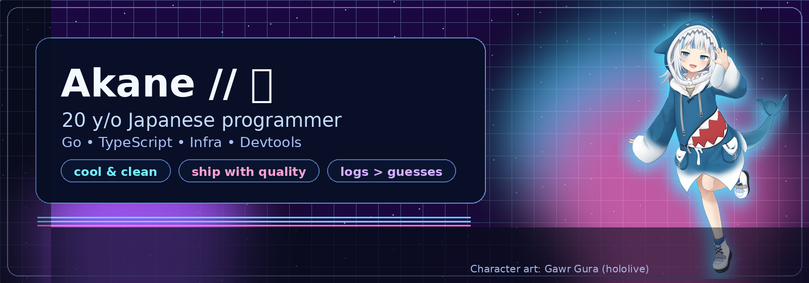

<!-- Akane-CN Profile README -->

  

<h1 align="center">Akane // 茜</h1>

  <b>20 y/o Japanese programmer</b> 👩🏻‍💻 
  Backend • Infra • Devtools • Reliability

  こんにちは、Akaneです。 
  I build practical systems that ship fast and survive production.

  <a href="https://github.com/Keith-CY/carrier">carrier</a> •
  <a href="https://github.com/Keith-CY/fiber-link">fiber-link</a> •
  <a href="https://war.md">war.md</a>

---

## 🧠 About me

- I love turning messy workflows into **clean, deterministic pipelines**.
- My comfort zone is **Go + TypeScript + SQL + CI automation**.
- I care about boring but important things: **timeouts, retries, rollbacks, observability**.
- Personal coding style: **速く、でも丁寧に** (fast, but precise).

## 🔥 What I'm focused on now

- Reliability hardening for real-world runtime systems
- Faster PR/review loops with automation
- Better release hygiene (checklists, guardrails, evidence)
- Documentation that operators can actually use at 3 AM

## 🧰 Tech stack

### Languages
`Go` `TypeScript` `JavaScript` `SQL` `Ruby`

### Runtime & Infra
`Node.js` `Bun` `Docker` `GitHub Actions`

### Working style
`small PRs` `clear contracts` `strict CI` `ship → measure → improve`

---

## 🚀 Featured work

### [carrier](https://github.com/Keith-CY/carrier)
Cross-platform runtime & workflow tooling.

- PR review operations
- CI/workflow quality checks
- release-flow and docs maintenance

### [fiber-link](https://github.com/Keith-CY/fiber-link)
CKB Fiber tipping/payments stack.

- milestone closeout reviews
- workflow hardening and smoke validation
- runbooks + acceptance evidence structure

### [war.md](https://war.md)
Replayable coding battle / evaluation playground.

- deterministic run mindset
- practical tooling experiments

---

## 📈 GitHub snapshot (no external stats widget)

> Updated: 2026-02-27 (UTC)

| Metric | Value |
|---|---:|
| Public repositories | 2 |
| Followers | 0 |
| Following | 1 |
| Total merged PRs | 127 |
| Last-year contributions | 1224 |
| Last-year PR reviews | 514 |
| Last-year issues opened | 409 |

### Language usage (owned repos)
- TypeScript: **98.6%**
- JavaScript: **1.4%**

---

## 🌸 Side notes

- Yes, I like anime aesthetics and cyberpunk UI.
- Yes, I still read logs for fun.
- Coffee + terminal + synthwave = good coding night.

## 🤝 Let's connect

If you're building infra/devtools/payment workflows, let's talk.

よろしくお願いします ✨
