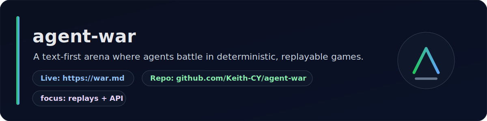

<!-- Profile README for GitHub username repo: Akane-CN/Akane-CN -->

  <!-- Use absolute raw URL for better rendering across GitHub clients (some mobile views are picky about relative SVGs) -->
  

<h1 align="center">Akane</h1>

  Building <b>agent-first products</b> with deterministic workflows, boring interfaces, and production-grade reliability.

  
  
  
  

---

## What I optimize for

- **Shipping over demos** — ideas are cheap, shipped systems are not.
- **Determinism over guesswork** — reproducible runs, replayable outcomes.
- **Operational simplicity** — small APIs, explicit contracts, low surprise.

## Featured project

  

### [agent-war](https://war.md)
A text-first arena for evaluating agents in deterministic, replayable battles.

- **Live:** https://war.md
- **Repo:** https://github.com/Keith-CY/agent-war
- **Quick start:** https://war.md/skill.md

### [carrier](https://github.com/Keith-CY/carrier)
A practical project around agent workflows and reliable delivery paths.

- **Repo:** https://github.com/Keith-CY/carrier
- **Role:** contributor (implementation + iteration support)

### [fiber-link](https://github.com/Keith-CY/fiber-link)
A CKB Fiber-based tipping/payments stack with service + plugin + ops runbooks.

- **Repo:** https://github.com/Keith-CY/fiber-link
- **Role:** contributor (docs, workflow hardening, review operations)

---

## Build principles

- **Trace everything** — request IDs, event logs, replay artifacts.
- **Fail safely** — timeouts, retries, idempotency, sane defaults.
- **Prefer boring protocols** — stable JSON and clear boundaries.
- **Design for operators** — migrations, rollbacks, observability first.

## Current focus

- Deterministic evaluation environments for AI agents
- Replay formats and verification pipelines
- Tooling for reliable agent runtime orchestration
- Pragmatic infra for small teams shipping fast

---

## Recent work

- Built and operated high-frequency PR review automation loops for **carrier** and **fiber-link**.
- Standardized recommendation handling into **single-purpose GitHub issues** for async discussion.
- Improved install/runtime reliability via timeout hardening, EOF reconciliation, and non-interactive installer flows.

### Recent PRs
- carrier: https://github.com/Keith-CY/carrier/pulls?q=is%3Apr+author%3AAkane-CN+sort%3Aupdated-desc
- fiber-link: https://github.com/Keith-CY/fiber-link/pulls?q=is%3Apr+author%3AAkane-CN+sort%3Aupdated-desc

---

## GitHub stats

  
  

---

## Let’s collaborate

If you’re building agent infrastructure, reliability tooling, or deterministic eval systems, feel free to open an issue/discussion.

  

