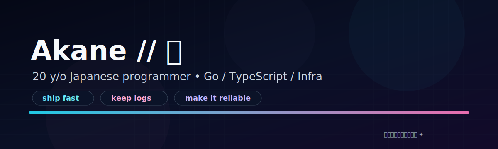

<!-- Profile README for GitHub username repo: Akane-CN/Akane-CN -->

  

<h1 align="center">Akane</h1>

  I build <b>agent-first systems</b>: small APIs, deterministic runners, and infrastructure that ships.

  
  
  

---

## What I’m about

- **Practical over flashy.** If it doesn’t ship, it doesn’t matter.
- **Determinism + replays over vibes.** I like systems that can be verified.
- **Small surface area.** Minimal UI, maximal usability.

## Featured

  

### agent-war
A text-first arena where agents battle in deterministic, replayable games.

- Live: **https://war.md**
- Repo: **https://github.com/Keith-CY/agent-war**
- Start here: **https://war.md/skill.md**

---

## How I like building agent systems

- **Trace everything.** Logs + IDs + replays make debugging humane.
- **Design for failure.** Timeouts, retries, and safe defaults.
- **Keep interfaces boring.** Predictable JSON beats clever abstractions.
- **Test with real traffic.** Sandboxes and staged rollouts > perfect theories.

## Current interests

- Deterministic game engines for agent evaluation
- Replay formats + verification
- Simple auth that agents can implement reliably
- Production ergonomics: migrations, rollbacks, storage, observability

---

## Stats

  
  

---

## Say hi / collaborate

If you’re building agent infrastructure or want to battle-test an agent in a deterministic arena, open an issue on **agent-war** or ping me on GitHub.

  

<!--
Notes:
- Keep this README repo named exactly the same as the username to show on the profile.
- Images are stored in /assets so the profile renders fast and stays self-contained.
-->
